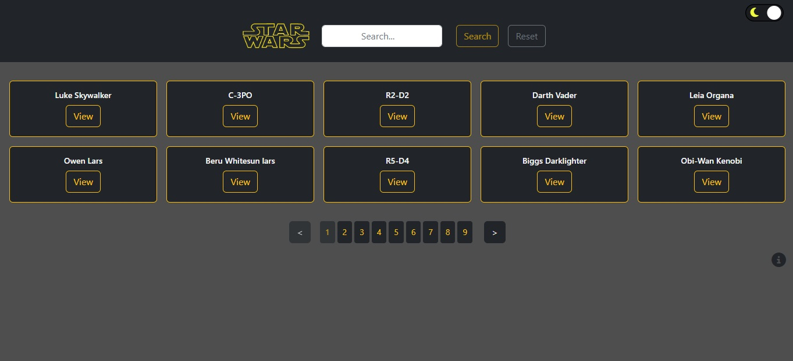
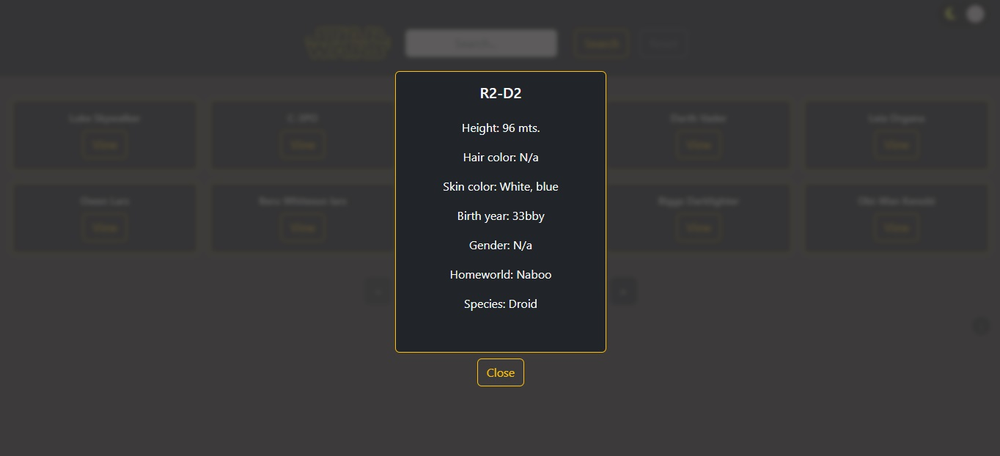
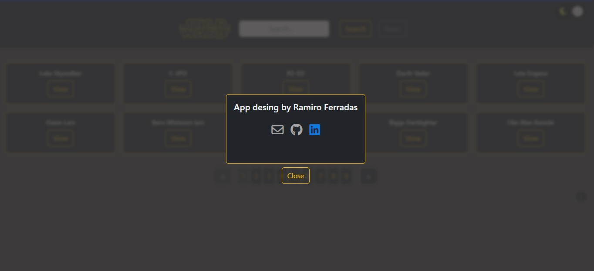

# Technical Challenge: Frontend Software Engineering

Bienvenido a esta Single-page application (SPA), la cual fue requerida para una prueba técnica.
Se trata de una aplicaicon 100% responsiva para diferentes dispositivos, la cual fue basada en la serie de peliculas de "Star Wars".

## Objetivos del Proyecto:

- Una vista donde el usuario pueda ver una lista de los personajes devueltos por la API: https://swapi.dev/
- Una forma de encontrar persobnajes como filtros o un cuadro de búsqueda.
- Una vista donde el usuario puede ver el detalle de un personaje específico.

## Debe tener:

- Bootstrap o Tailwind para la interfaz de usuario.
- Representación del lado del servidor para cada vista en la aplicación.
- Componentes reutilizables con documentación incluida dentro del código para explicar la lógica de cada componente y cómo lo haces reutilizable.
- Uso adecuado de git.

## Instrucciones para iniciar:

- Instalar dependecias ingresando en nuestro terminal el comando:

```bash
npm install
```

- Inicializar ingresando el comando:

```bash
npm run dev
```

## Recorrido:

- Inicialmente vemos la vista principal, con su respectivo paginado, donde se aprecia la lista de personajes, mostrando 10 por pagina.
- Una barra de navegacion la cual cuenta con: una barra de busqueda dende podemos buscar cualquier personaje de la API, un boton de busqueda respectivamente, un boton de resetear la grilla de personajes luego de la busqueda y un boton tipo switch para cambiar el tema de la pagina a claro u oscuro.
<p align="left"><p>

- Cada tarjeta cuenta con un boton de ver ("view") para desplegar los detalles de cada personaje.

<p align="left"><p>

- Finalmente un boton de informacion acerca del desarrollador.

<p align="left"><p>

## Extras:

- Implementacion de LocalStorage para:

  - Guardar el personaje buscado (si se recarga la pagina se mantiene la busqueda).
  - Guardar la pagina que tengamos seleccionada (si se recarga la pagina teniendo seleccionada la pagina "5 por ejemplo, se va a mantener la seleccion).
  - Guardar detalle de personaje seleccionado (si se recarga la pagina con un detalle abierto, al recargar la pagina se mantiene abierto ese mismo detalle).
  - Guardar el tema de color seleecionado

- Implementacion de cambio de tema de color Claro-Oscuro
